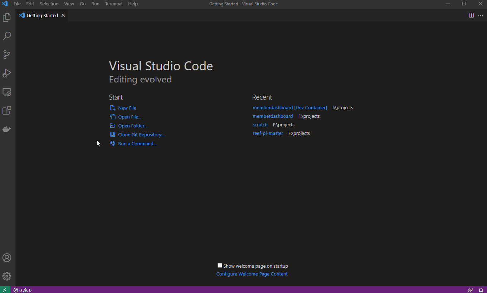

# Member Dashboard

## Introduction
Member Dashboard is the source of truth for who has access to what at the makerspace.  
Membership statuses will be pulled down from Payment Providers on a daily basis.  
If a member has made a payment in the past 30 days, they will be considered an active member.

## High level

- The server pulls payment information from paypal (and stores in the db) so we can tell who is currently an active member
- the server will maintain access lists and periodically push those access lists to the microcontrollers on the network
- The microcontroller (aka a resource) stores its access list locally so it's not dependant on the network when someone wants to access the space

# Dev Setup

## The Easy Way (using Remote-Containers)
Install the following
- [Docker](https://www.docker.com/products/docker-desktop)
- [VS Code](https://code.visualstudio.com/download)
- VS Code [Remote-Containers](https://marketplace.visualstudio.com/items?itemName=ms-vscode-remote.remote-containers) extension 

That's it! Nothing else needs to be installed.  

If you are on Windows, then it is recommended to clone to the repo to a folder on the WSL for best performance.  

Either open the folder in VS Code and choose reopen in container or run the Remote-Containers: Open Folder in Container... command and select the local folder.




The backend server can be started by debugging in VS Code. Otherwise, you can start the server without debugging using `sh buildandrun.sh`.

Start the react app as described in the [UI README](/ui/README.md).
```
# navigate to ui folder
cd ui

# install node modules
$ npm ci

# run local env
$ npm run dev
```

If you feel cramped in the VS Code terminal pane, you can still connect to dev container shell from your favorite terminal using
```
docker exec -it -u vscode memberdashboard_dev_1 bash
```

Now, go write code and implement features!

---

## The Not-As-Easy Way

You need to install at least:

- [docker](https://docs.docker.com/get-docker/)
- [docker-compose](https://docs.docker.com/compose/install/)
- [go](https://golang.org/doc/install)
- [node](https://nodejs.org/en/)
- [migrate CLI](https://github.com/golang-migrate/migrate/tree/master/cmd/migrate)

Follow the [README](/ui/README.md) in the ui directory to install the npm modules

maybe do this one separately

```
npm install --global rollup
```

### Start the app

This project uses docker.
A testing environment can be spun up by running the build script.

```
sh buildandrun.sh
```

### Seed the DB with test data

Create a membership database and grant rights to user test

```
cd test/postgres
sh seedLocal.sh
```

### How to install golang-migrate
```
go install github.com/golang-migrate/migrate/v4/cmd/migrate
```

### CONFIG file

This app requires a config file.
The path for the config file is set using the `MEMBER_SERVER_CONFIG_FILE` environment variable.

the `sample.config.json` can be used as a template for this file.

```
export MEMBER_SERVER_CONFIG_FILE="/etc/hackrva/config.json"
```

---
  
## Development Tasks

### Database Migrations
Database migrations are managed using [golang-migrate/migrate](https://github.com/golang-migrate/migrate).  The CLI is already available when using Remote-Containers, otherwise it will need to be installed.

### How to add a migration
A migration can be added by creating an up and down migration file in the migrations folder.  The migration file names should be named according to {sequentialNumber}_{description}.up.sql and {sequentialNumber}_{description}.down.sql.  Migrations can be created with the following command.
```
make migration name=<NAME>
```
Populate the up and down scripts.  Up scripts should be idempotent.  Down scripts should revert all changes made by up script

### How to run a migration

Migrations can be applied using the CLI
```
make migrate-up
```

### Generating Swagger Docs
When using Remote-Containers, swagger documentation can be updated using.
```
make swagger
```
Otherwise, follow instructions in [./docs/README.md](./docs/README.md) to install swagger first.

### Querying Postgres
The following options are available if using Remote-Containers.
- Use the [PostgreSQL extension](https://marketplace.visualstudio.com/items?itemName=ckolkman.vscode-postgres) in VS Code
- Use pgAdmin on [localhost:8080](http://localhost:8080) with info@hackrva.org/test
- Use make run-sql or make run-sql-command
