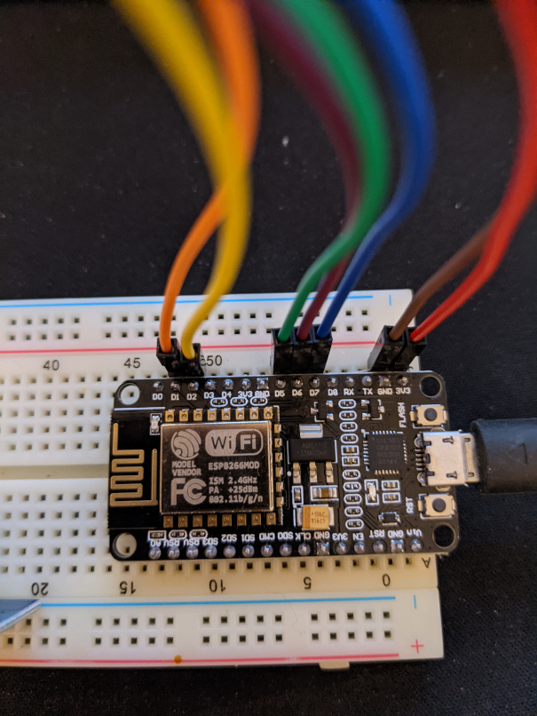

For prototyping, I'm using a [nodemcu 1.0 ESP8266](https://github.com/nodemcu/nodemcu-devkit-v1.0) with the [rc522 13.56mhz rfid](https://components101.com/wireless/rc522-rfid-module)

These should be easy to find.

| RFID | ESP8266 |
|:-----|--------:|
| 3.3V | 3.3V    |
| RST  | 1       |
| GND  | GND     |
| MISO | 6       |
| MOSI | 7       |
| SCK  | 5       |
| SDA  | 2       |
| IRQ  | -       |

